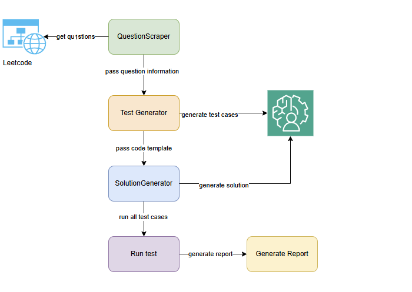

# CodeGen

## Introduction

This project provides a template for a code generation pipeline designed to solve algorithmic problems automatically. At a high level, the pipeline first scrapes algorithmic questions from LeetCode. The metadata for each question, including the title, difficulty, and problem description, is stored in a pandas DataFrame.

In the next step, the pipeline generates a Python code template and a set of basic test cases for each question within a `pytest` framework. A large language model (LLM) can then be used to complete the code template by generating a solution. Finally, we can execute the `pytest` framework to evaluate the generated solution and determine how many test cases it passes.

A key area for future development is enhancing the test case generation. Since the initial scrape only provides a few basic tests, we plan to use few-shot prompting techniques with a language model to generate more complex and comprehensive test cases.


---

## Question Downloader

The `get_questions.py` script utilizes the `leetscrape` open-source library to download algorithmic questions from the LeetCode website. The downloaded data, which includes the title, question ID, and the HTML body of the question, is stored in a pandas DataFrame. This information is then used as input for the generative model to produce a solution later in the pipeline.

**Note:** `leetscrape` is not an official LeetCode API. It scrapes the public-facing content of the LeetCode website. Consequently, non-public information, such as complete test suites and official solutions, cannot be downloaded with this library.

---

## Data Extractor

The `extractor.py` script is responsible for extracting the code template and basic test cases for each question, also leveraging the `leetscrape` library. For each problem, the extractor generates two files:

1.  A Python file containing a code template. This template is designed for an LLM to fill in with a proposed solution.
2.  A `pytest` file containing a test framework with a few initial test cases. This file imports the solution from the first file and runs it against the test cases to check for correctness.

#### Sample Code Template

The language model will generate the solution by replacing the `pass` statement in the method.

```python
from typing import List

class Solution:
    def twoSum(self, nums: List[int], target: int) -> List[int]:
        pass
````

#### Sample Pytest File

This code allows us to directly execute the LLM-generated solution and verify how many test cases are successfully passed.

```python
import pytest
from a_two_sum import Solution  # Assuming the solution file is named a_two_sum.py

@pytest.mark.parametrize(
    "nums, target, output",
    [
        ([2, 7, 11, 15], 9, [0, 1]),
        ([3, 2, 4], 6, [1, 2]),
        ([3, 3], 6, [0, 1]),
    ],
)
def test_twoSum(nums: List[int], target: int, output: List[int]):
    sc = Solution()
    assert sc.twoSum(nums, target) == output
```

-----

## Solution Generator

The `llm_code_generation.py` script contains the class that uses a language model to generate a solution for a given LeetCode question. This component currently uses DeepSeek, a freely available language model. At its current stage, this implementation is not yet optimal, as solution generation can be very slow. This likely indicates that further refinement of the model interaction or prompting strategy is required.

-----

## Test Case Generator

As mentioned previously, the `leetscrape` library can only scrape a small number of public test cases (typically three) from the website, which is insufficient for robustly evaluating solutions. To address this, we plan to implement a test generation class. This component will use a few-shot learning strategy with a powerful LLM to generate a wider variety of valid test cases. The goal is to produce tests that cover edge cases, load testing scenarios, and other complexities not addressed by the basic examples.
